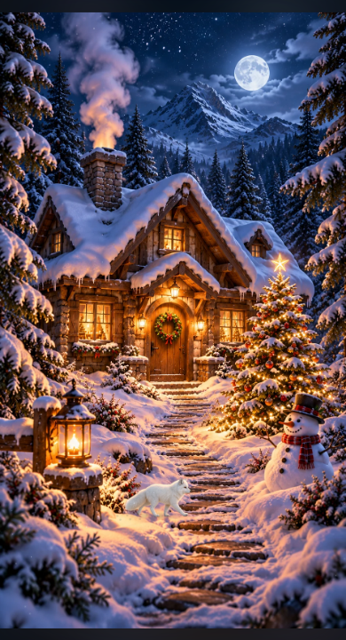

# Christmas Village 🎄

A quiet winter hideaway you can touch. Snow falls outside a cabin; open the door
and settle beside the fire. Built for a phone held upright, with no visible text
or menus.

**[Enter the village](https://christmasvillage.cloud)**

<p align="center">
  
  
</p>

## Explore

Touch the windows, tree or lantern to switch their lights. Brush snow off the roof,
greet the snowman, then open the cabin door. Inside, tend the fire, light up a gift bow,
or warm your cocoa. The right-hand door takes you outside again.

A white Arctic fox occasionally walks across the snow, leaving fading pawprints.
Touch the foreground path to invite it, or touch the moon to make a shooting-star
wish. Snow drifts at different depths; inside, you can watch flakes through the
window and delicate steam curling above your cocoa.

<p align="center"></p>

Generated cinematic backgrounds, clipped light plates and one Canvas loop form
the scenes. Snow has depth and drift; fire uses the original flame texture with
gentle displacement. This is animated artwork, not a 3D game. No accounts,
tracking, external fonts or audio.

## Run locally

Use Node.js 22.12+ or 24 LTS.

```sh
npm ci
npm run dev
```

Open `http://127.0.0.1:5173`. `npm run build` produces cacheable web assets in
`dist`; `npm run preview` serves them locally. The complete portrait fits the
viewport with a blurred surround on wider screens.

## iOS

Run `npm run ios:sync`, then open `ios/ChristmasVillage.xcodeproj` on a Mac with
Xcode. Choose an iOS 16+ simulator. For a device, set your development Team and
unique bundle identifier. The SwiftUI shell loads a self-contained WKWebView
page offline. The iOS build is separate from the web build. Windows browser
checks do not verify Xcode, WKWebView, device performance or VoiceOver.

## Verify and deploy

```sh
npx playwright install chromium
npm test
npm run build
npm run ios:sync
node scripts/check-bundle.mjs
npm run deploy
```

Wrangler deploys static assets to Cloudflare Workers with `christmasvillage.cloud`.
Forks must change the account, Worker name and domain in `wrangler.jsonc`.
Use `npx wrangler login` for local deployment.

The workflow runs on `v*` tags or manual dispatch. It checks both builds.
Automatic deployment is configured for this repository. Forks need repository secrets `CLOUDFLARE_API_TOKEN` and
`CLOUDFLARE_ACCOUNT_ID`; otherwise it reports a notice and skips deployment.
Credentials are never included in source. Releases are created explicitly with
reviewed notes and a downloadable iOS source bundle.

Tab, Enter and Space operate the scene; Escape exits the cabin. System reduced
motion produces a still scene and immediate switches. Animation pauses when
hidden. Browser tests cover touch, transitions, retained light state, keyboard
controls, reduced motion and the offline bundle.

## Source and artwork

- `src/scene-config.ts`: artwork, hotspot geometry and light masks.
- `src/animation.ts`: Canvas snow, fire, steam and particles.
- `src/fox.ts`: eight-frame Arctic fox walk, ground shadow and fading pawprints.
- `src/atmosphere.ts`: smoke, steam and snow beyond the cabin window.
- `src/main.ts`: state, asset loading and scene transitions.
- `ios/`: SwiftUI shell and synchronized offline page.
- [Image prompts](docs/image-prompts.md), [changelog](CHANGELOG.md), [contributing](CONTRIBUTING.md).

Code and included artwork: [MIT](LICENSE). Backgrounds were created with OpenAI
ImageGen; prompts and provenance are recorded in the document above. Dependencies
retain their own licenses.
